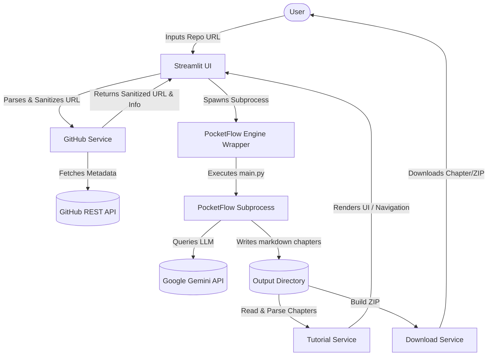

# 🤖 AI Codebase Assistant

Analyze public GitHub repositories and generate AI-powered, multi-chapter tutorials using PocketFlow and Google Gemini.

---

## 🎨 Application Screenshots

| **1. Repository Analysis Input** | **2. Codebase Dashboard & Chapter Viewer** |
| :---: | :---: |
|  <br> *Clean, secure input page with real-time domain and path validation.* |  <br> *Visual grid cards showing repository metadata alongside chapter markdown text.* |

---

## ⚙️ System Architecture

The following diagram illustrates the architecture, sanitization boundary, and data flow of the application:



---

## ✨ Features

| Feature                    | Status | Description |
| -------------------------- | ------ | ----------- |
| Analyze GitHub Repository  | ✅      | Fetches metadata and initiates structured tutorial pipeline. |
| Repository Dashboard       | ✅      | Beautiful Streamlit metrics card layout showing repo stats. |
| PocketFlow Integration     | ✅      | Safe, sandboxed subprocess-based orchestration. |
| AI Tutorial Generation     | ✅      | Generates highly descriptive markdown guides via Google Gemini. |
| Markdown Tutorial Viewer   | ✅      | Multi-chapter text viewer with sync sidebar controls. |
| Download Chapter           | ✅      | Export the active markdown chapter on-demand. |
| Download Tutorial ZIP      | ✅      | Caching-backed ZIP generator of all chapters. |
| Session State Preservation | ✅      | Prevents pocketflow analysis reruns on sidebar clicking. |
| Structured Logging         | ✅      | Multi-level log files and console formats. |
| Error Handling             | ✅      | Comprehensive user-friendly alerts. |
| Local Folder Analysis      | 🔮 V2  | Analyze local code projects. |
| ZIP Upload                 | 🔮 V2  | Upload codebase folder packages. |
| PDF Export                 | 🔮 V2  | Export full manuals as PDF prints. |
| AI Chat / RAG              | 🔮 V2  | Converse dynamically with the codebase. |

---

## 🛠️ Tech Stack

- **Python** 3.12+
- **Streamlit** — Web UI framework
- **PocketFlow** — Code analysis orchestration engine
- **Google Gemini** — LLM Q&A generation
- **GitHub REST API** — Code repository validation and statistics
- **fpdf2** — PDF generation engine

---

## 📁 Project Structure

```
AI-Codebase-Assistant/
├── app.py                      # Entry point
├── config.py                   # Central configuration
├── requirements.txt            # Dependencies
├── .env.example                # Environment template
│
├── services/                   # Business logic
│   ├── github_service.py       # GitHub API + URL parsing
│   ├── analysis_service.py     # Analysis orchestration
│   ├── tutorial_service.py     # Tutorial generation + reading
│   ├── download_service.py     # Downloads + ZIP
│   ├── local_service.py        # Local folder logic (V2)
│   ├── zip_service.py          # ZIP uploads logic (V2)
│   ├── pdf_service.py          # PDF export logic (V2)
│   ├── chat_service.py         # AI Q&A Chat logic (V2)
│   └── tree_service.py         # Directory tree fetcher (V2)
│
├── frontend/                   # Streamlit UI
│   ├── home.py                 # Page orchestrator
│   ├── sidebar.py              # Sidebar navigation
│   ├── dashboard.py            # Repository dashboard
│   ├── tutorial.py             # Tutorial viewer
│   ├── downloads.py            # Download section
│   ├── components.py           # Shared UI components
│   └── state.py                # Session state management
│
├── backend/                    # Legacy wrappers / utilities
│   └── repository_tree.py      # Folder structure printer (V2)
│
├── external/                   # Third-party integrations
│   └── pocketflow.py           # PocketFlow subprocess wrapper
│
├── utils/                      # Shared utilities
│   ├── logger.py               # Rotating logger
│   └── exceptions.py           # Custom exception hierarchy
│
└── logs/                       # Runtime logs (gitignored)
```

---

## 🚀 Getting Started

### Prerequisites

- Python 3.11+
- [PocketFlow Tutorial project](https://github.com/The-Pocket/PocketFlow-Tutorial-Codebase-Knowledge) cloned locally
- Google Gemini API key (configured in environment)

### Installation
```bash
# Clone this repository
git clone https://github.com/your-username/AI-Codebase-Assistant.git
cd AI-Codebase-Assistant

# Create virtual environment
python -m venv .venv
source .venv/bin/activate        # On Windows: .venv\Scripts\activate

# Install dependencies
pip install -r requirements.txt

# Configure environment variables
copy .env.example .env          # On Linux/macOS: cp .env.example .env
```

### Running Locally
```bash
streamlit run app.py
```

### Running with Docker (Self-contained)
```bash
# Build the Docker image
docker build -t ai-codebase-assistant .

# Run the container
docker run -p 8501:8501 --env GEMINI_API_KEY="your_api_key" ai-codebase-assistant
```

---

## ⚙️ Environment Configuration

| Variable             | Description                          | Default Fallback |
| -------------------- | ------------------------------------ | ---------------------------------------------------------- |
| `GEMINI_API_KEY`     | Google Gemini API key                | — |
| `GITHUB_TOKEN`       | GitHub API Token (avoid rate limit)  | — |
| `POCKETFLOW_PATH`    | PocketFlow project directory         | Resolves to `../PocketFlow-Tutorial-Codebase-Knowledge-main` relative to project root |
| `DEFAULT_TIMEOUT`    | API request timeout (seconds)       | `30` |
| `POCKETFLOW_TIMEOUT` | PocketFlow execution timeout (secs)  | `300` |

---

## 👥 Contributing
Contributions are welcome! Please read [`CONTRIBUTING.md`](CONTRIBUTING.md) for local setup, testing guidelines, and commit standards.

---

## 📄 License
This project is licensed under the MIT License. See [`LICENSE`](LICENSE) for details.
