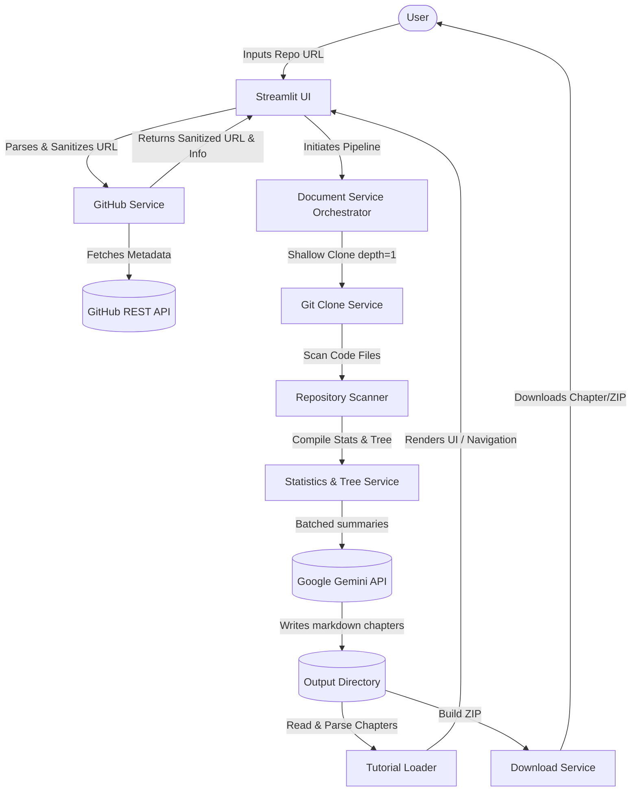

# 🤖 AI Codebase Assistant

Analyze public GitHub repositories and generate AI-powered, multi-chapter documentation using a local clone scanner and the Google Gemini API.

---

## 🎨 Application Screenshots

| **1. Repository Analysis Input** | **2. Codebase Dashboard & Chapter Viewer** |
| :---: | :---: |
|  <br> *Clean, secure input page with real-time domain and path validation.* |  <br> *Visual grid cards showing repository metadata alongside chapter markdown text.* |

---

## ⚙️ System Architecture

The following diagram illustrates the architecture, sanitization boundary, and optimized data flow of the application:



---

## ✨ Features

| Feature                    | Status | Description |
| -------------------------- | ------ | ----------- |
| Analyze GitHub Repository  | ✅      | Fetches metadata and initiates local shallow clone pipeline. |
| Repository Dashboard       | ✅      | Beautiful Streamlit metrics card layout showing repo metadata, stats, and files counts. |
| Codebase Statistics        | ✅      | Computes Lines of Code (LOC), Python/Markdown files, average file size, and largest file. |
| Directory Tree Visualizer  | ✅      | Renders recursive directory folder structures in a clean explorer code box. |
| Gemini API Optimization    | ✅      | Batches file summaries (30/request) and folder summaries (1/request) to stay below rate limits. |
| Single-Call Chapters Gen   | ✅      | Compiles all 6 chapters in a single structured JSON request to prevent 429 quota exhaustion. |
| Prompt Caching             | ✅      | SHA-256 hash-based disk caching to avoid redundant API queries. |
| Exponential Backoff Retry  | ✅      | Automatically intercepts 429 status codes and delays queries according to API retryDelay values. |
| Markdown Tutorial Viewer   | ✅      | Multi-chapter text viewer with sync sidebar controls. |
| Download Chapters & ZIP    | ✅      | Export active markdown chapters or download all chapters as a unified ZIP archive. |
| Structured Logging         | ✅      | Multi-level log files and console formats. |
| Error Handling & Boundaries| ✅      | Comprehensive user-friendly alerts and fallback mock layouts in case of API failures. |

---

## 🛠️ Tech Stack

- **Python** 3.12+
- **Streamlit** — Web UI framework
- **Google Gemini** — LLM Q&A generation (via `google-genai` SDK)
- **GitHub REST API** — Code repository validation and statistics
- **GitPython** — Git clone client SDK
- **fpdf2** — PDF generation engine

---

## 📁 Project Structure

```
AI-Codebase-Assistant/
├── app.py                      # Streamlit application entry point
├── config.py                   # Central configuration
├── requirements.txt            # Package dependencies
├── .env.example                # Environment variables template
│
├── utils/                      # Shared utilities
│   ├── gemini_client.py        # Centralized LLM caching & retry logic
│   ├── exceptions.py           # Custom exception definitions
│   └── logger.py               # Rotating logger setup
│
├── services/                   # Business logic layers
│   ├── github_service.py       # GitHub REST API + URL parsing
│   ├── github_clone_service.py # Git clone and workspace disk cleanups
│   ├── repository_scanner.py   # Recursive local workspace scanners
│   ├── statistics_service.py   # Code metrics calculation
│   ├── tree_service.py         # Directory tree mapper
│   ├── summary_service.py      # Batched code and folder summarizers
│   ├── chapter_service.py      # Batched chapter compiler
│   ├── markdown_service.py     # Markdown disk writer
│   └── document_service.py     # Master documentation orchestrator
│
├── frontend/                   # Streamlit UI Layer
│   ├── home.py                 # Page content manager
│   ├── sidebar.py              # Sidebar navigation controls
│   ├── dashboard.py            # Codebase dashboard metrics cards
│   ├── tutorial.py             # Chapters tutorial viewer
│   ├── components.py           # Shared UI cards & headers
│   └── state.py                # Session state properties
│
└── logs/                       # Runtime logs (gitignored)
```

---

## 🚀 Getting Started

### Prerequisites

- Python 3.12+
- Google Gemini API key (configured in environment)

### Installation

```bash
# Clone this repository
git clone https://github.com/your-username/AI-Codebase-Assistant.git
cd AI-Codebase-Assistant

# Create virtual environment
python -m venv .venv
source .venv/bin/activate        # On Windows: .venv\Scripts\activate

# Install dependencies
pip install -r requirements.txt

# Configure environment variables
copy .env.example .env          # On Linux/macOS: cp .env.example .env
```

### Running Locally

```bash
streamlit run app.py
```

### Running with Docker (Self-contained)

```bash
# Build the Docker image
docker build -t ai-codebase-assistant .

# Run the container
docker run -p 8501:8501 --env GEMINI_API_KEY="your_api_key" ai-codebase-assistant
```

---

## ⚙️ Environment Configuration

| Variable          | Required | Description | Default Fallback |
| ----------------- | -------- | ----------- | ---------------- |
| `GEMINI_API_KEY`  | Yes      | Google Gemini API key | — |
| `GEMINI_MODEL`    | No       | Google Gemini model to use | `gemini-2.5-flash` |
| `GITHUB_TOKEN`    | No       | GitHub API Token (avoids rate limits) | — |
| `DEFAULT_TIMEOUT` | No       | API request timeout (seconds) | `30` |

---

## 📄 License
This project is licensed under the MIT License. See [`LICENSE`](LICENSE) for details.
