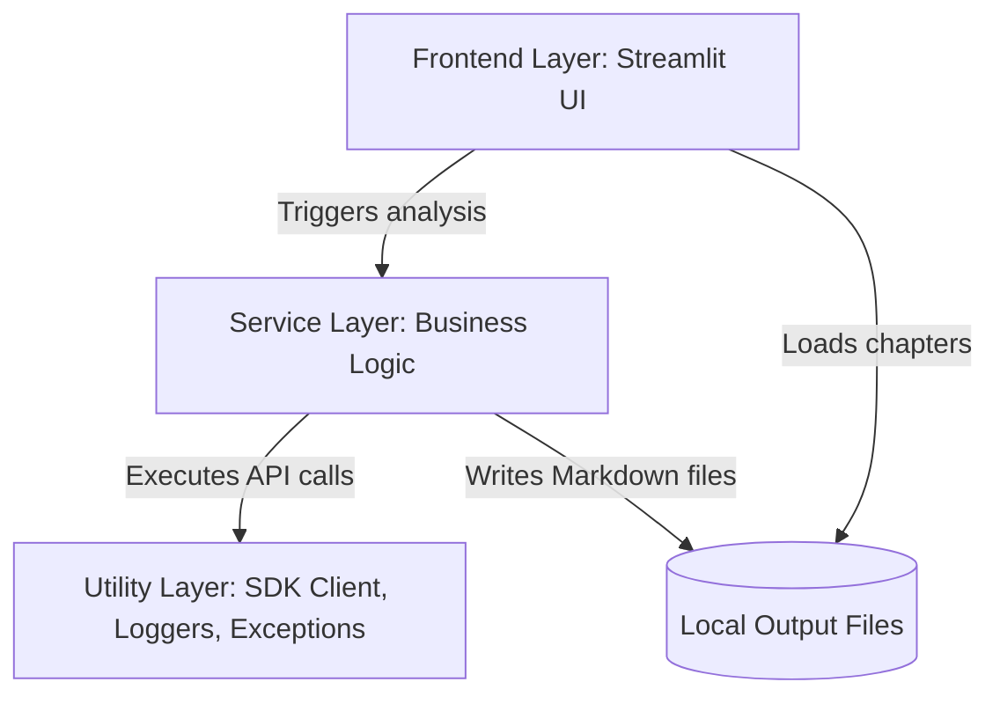

# Codebase Architecture Guide

This document describes the high-level architecture, directory layout, and file-level responsibilities of the AI Codebase Assistant.

---

## 🏗️ Architectural Pattern

The application is structured using a clean, separation-of-concerns layered design, isolating the user interface from business loggers, Git operations, and direct Gemini API queries.

### Layer Separation
1. **Frontend UI Layer (`frontend/`):** Streamlit layout management, widget routing, session states, and dashboard components. Immutably separates display cards from direct data queries.
2. **Business Services Layer (`services/`):** Clones, scans, statistics compilers, batch summarizers, chapter compilers, and markdown output writers.
3. **Utilities Layer (`utils/`):** Central caching client, logger setups, and standard application exception classes.

---

## 📁 Repository Directory Structure

* **`app.py`**: Streamlit application entry point. Configures layout settings, triggers logger setup, and routes to home manager.
* **`config.py`**: Declares application titles, default timeouts, relative folders paths, and version tags.
* **`utils/`**:
  * [`gemini_client.py`](file:///d:/AI_Map/AI-Codebase-Assistant/utils/gemini_client.py): central client handling API requests, SHA-256 caching, and HTTP 429 exponential backoffs.
  * [`exceptions.py`](file:///d:/AI_Map/AI-Codebase-Assistant/utils/exceptions.py): Custom application exceptions displaying custom user-friendly messages.
  * [`logger.py`](file:///d:/AI_Map/AI-Codebase-Assistant/utils/logger.py): Handles standard log routing to console and rotating files under `logs/`.
* **`services/`**:
  * [`github_service.py`](file:///d:/AI_Map/AI-Codebase-Assistant/services/github_service.py): GitHub URL parsing and metadata queries via GitHub REST API.
  * [`github_clone_service.py`](file:///d:/AI_Map/AI-Codebase-Assistant/services/github_clone_service.py): shallow clones and force cleanup handlers.
  * [`repository_scanner.py`](file:///d:/AI_Map/AI-Codebase-Assistant/services/repository_scanner.py): recursive scanning of files based on exclusions and extensions.
  * [`statistics_service.py`](file:///d:/AI_Map/AI-Codebase-Assistant/services/statistics_service.py): LOC calculations and codebase counts.
  * [`tree_service.py`](file:///d:/AI_Map/AI-Codebase-Assistant/services/tree_service.py): generates text-based visual tree structures of directories.
  * [`summary_service.py`](file:///d:/AI_Map/AI-Codebase-Assistant/services/summary_service.py): batches and maps folder/file summaries using Gemini.
  * [`chapter_service.py`](file:///d:/AI_Map/AI-Codebase-Assistant/services/chapter_service.py): generates all 6 Markdown documentation chapters in a single API query.
  * [`markdown_service.py`](file:///d:/AI_Map/AI-Codebase-Assistant/services/markdown_service.py): compiles final files on local disk.
  * [`document_service.py`](file:///d:/AI_Map/AI-Codebase-Assistant/services/document_service.py): coordinates cloning, scanning, summarizing, writing, and metrics collection.
* **`frontend/`**:
  * [`home.py`](file:///d:/AI_Map/AI-Codebase-Assistant/frontend/home.py): manages input routing and display rendering.
  * [`sidebar.py`](file:///d:/AI_Map/AI-Codebase-Assistant/frontend/sidebar.py): handles radio sidebar selection and roadmaps expanders.
  * [`dashboard.py`](file:///d:/AI_Map/AI-Codebase-Assistant/frontend/dashboard.py): metrics layout cards and tree outputs.
  * [`tutorial.py`](file:///d:/AI_Map/AI-Codebase-Assistant/frontend/tutorial.py): loads chapters from output files and displays them with next/prev buttons.
  * [`components.py`](file:///d:/AI_Map/AI-Codebase-Assistant/frontend/components.py): shared design elements.
  * [`state.py`](file:///d:/AI_Map/AI-Codebase-Assistant/frontend/state.py): session state declarations and resets.
