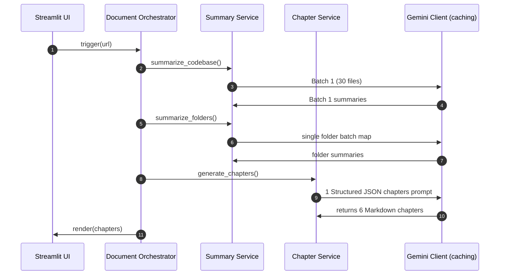

# System Design Guide

This document describes key design decisions, trade-offs, and optimization strategies implemented in Version 2 of the AI Codebase Assistant.

---

## ⚡ Gemini API Minimization Strategy

The application is specifically designed to minimize API consumption, allowing the tool to run comfortably on Gemini API Free Tier limits (typically 15 requests/minute).



### 1. File & Directory Batching
* **Traditional Approach:** Call the LLM API for each individual file (e.g. 50 files = 50 API calls) and folder.
* **Optimized Approach:**
  * Code files are grouped into batches of **30 files per request** (based on standard tokens and context limits).
  * Folder summaries are grouped into a **single, unified prompt request** listing all files and their short summaries.

### 2. Single-Call Chapters Generation
* Instead of issuing 6 consecutive API calls to write the 6 chapters separately, the application uses **Structured Output Enforcements** (`response_mime_type="application/json"`).
* The prompt queries Gemini to write all 6 chapters at once, returning a JSON map:
  ```json
  {
    "01_repository_summary.md": "# Summary...",
    "02_architecture.md": "# Architecture...",
    ...
  }
  ```
* Generates the entire handbook in **exactly 1 API call**, bringing total pipeline consumption for average codebases below **5 API requests**.

---

## 💾 Prompt Caching Layer

To prevent redundant API queries on identical prompts, `gemini_client.py` implements local disk caching:
1. **Hashing:** Computes a SHA-256 hash of the system instruction and prompt:
   `hash_key = sha256(system_instruction + prompt)`
2. **Persistence:** Saves hits under `.cache/gemini_cache.json` (gitignored).
3. **Execution:** On request, if `hash_key` matches an entry, it returns the cached text immediately (takes <1ms), consuming **0 API quota**.

---

## ⏳ Exponential Backoff Retry Handler

To resolve `429 RESOURCE_EXHAUSTED` rate limits gracefully, the client:
1. Catches HTTP errors and checks if the status code is `429`.
2. Searches the API's returned error response structure for the exact `retryDelay` field (e.g., `'retryDelay': '21s'`).
3. If found, pauses execution for the exact delay, applying an exponential backoff factor on consecutive failures:
   `sleep_duration = delay * (1.5 ** (attempt - 1))`
4. Retries the query up to 3 times before falling back to clean default error alerts.
